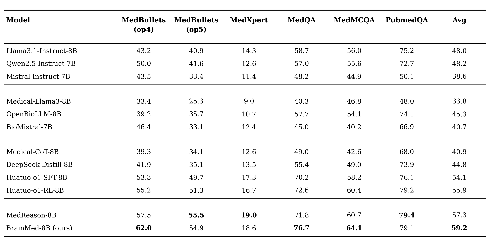
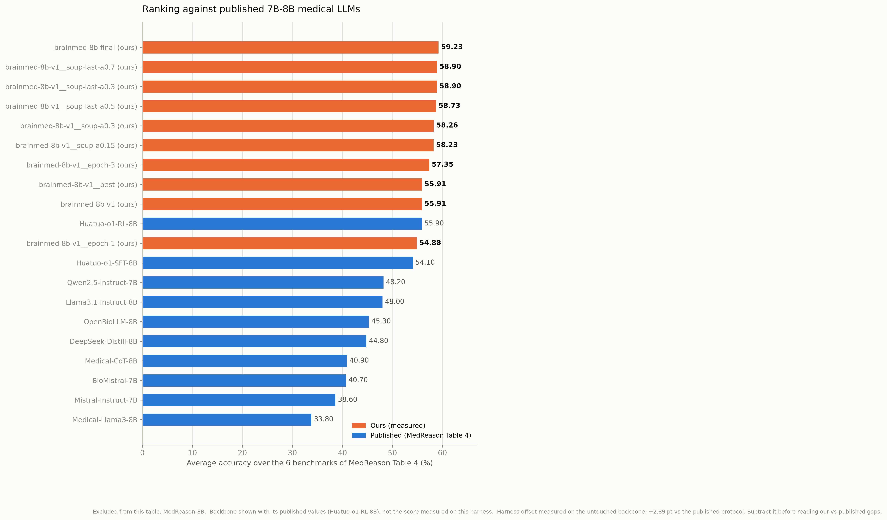
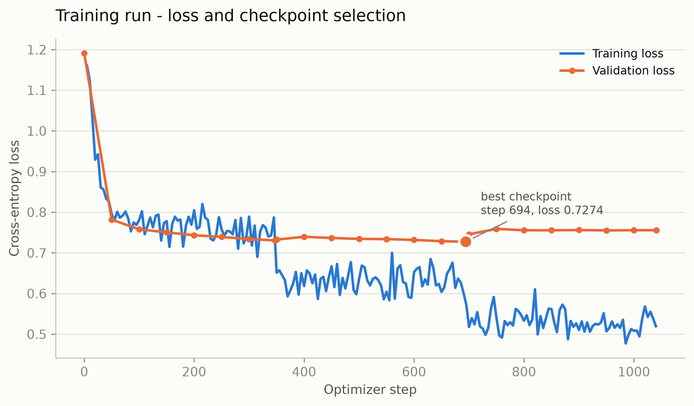
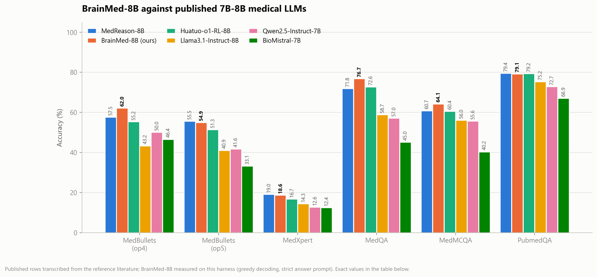

# BrainMed-8B

**Training and evaluation pipeline for an 8B medical reasoning model.**

[](https://huggingface.co/BrainHealthAI/BrainMed-8B)
[](https://huggingface.co/BrainHealthAI/BrainMed-8B-SFT)
[](https://huggingface.co/datasets/Williamsanderson/MedReason-MedO1-Reasoning-46K)
[](LICENSE)

Full-parameter supervised fine-tuning of an 8B backbone on 44,351 verified medical
chain-of-thought traces, evaluated on **10 benchmarks** with a reproducible harness, a
measured harness-offset calibration, contamination accounting, and paired significance
testing.

> **Research artefact. Not medical advice, not a medical device, not clinically validated.**

---

## Results

Accuracy (%) on the six-benchmark suite used by the reference literature. `BrainMed-8B` rows
are measured by this pipeline; every other row is transcribed from published tables.

| Model | MedBullets op4 | op5 | MedXpertQA | MedQA | MedMCQA | PubMedQA | **Avg** |
|---|---|---|---|---|---|---|---|
| Medical-Llama3-8B | 33.4 | 25.3 | 9.0 | 40.3 | 46.8 | 48.0 | 33.8 |
| Mistral-7B-Instruct | 43.5 | 33.4 | 11.4 | 48.2 | 44.9 | 50.1 | 38.6 |
| BioMistral-7B | 46.4 | 33.1 | 12.4 | 45.0 | 40.2 | 66.9 | 40.7 |
| Medical-CoT-8B | 39.3 | 34.1 | 12.6 | 49.0 | 42.6 | 68.0 | 40.9 |
| DeepSeek-R1-Distill-8B | 41.9 | 35.1 | 13.5 | 55.4 | 49.0 | 73.9 | 44.8 |
| OpenBioLLM-8B | 39.2 | 35.7 | 10.7 | 57.7 | 54.1 | 74.1 | 45.3 |
| Llama-3.1-8B-Instruct | 43.2 | 40.9 | 14.3 | 58.7 | 56.0 | 75.2 | 48.0 |
| Qwen2.5-7B-Instruct | 50.0 | 41.6 | 12.6 | 57.0 | 55.6 | 72.7 | 48.2 |
| HuatuoGPT-o1-8B (SFT) | 53.3 | 49.7 | 17.3 | 70.2 | 58.2 | 76.1 | 54.1 |
| HuatuoGPT-o1-8B (RL) | 55.2 | 51.3 | 16.7 | 72.6 | 60.4 | 79.2 | 55.9 |
| MedReason-8B | 57.5 | 55.5 | 19.0 | 71.8 | 60.7 | 79.4 | 57.3 |
| **BrainMed-8B-SFT** | 58.77 | 56.82 | 18.08 | 72.11 | 61.20 | 77.10 | **57.35** |
| **BrainMed-8B** | 62.01 | 54.87 | 18.63 | 76.67 | 64.07 | 79.10 | **59.23** |





### Full 10-benchmark suite

| | MedQA | MedMCQA | PubMedQA | MMLU-Pro (Med) | MB op4 | MB op5 | MedXpertQA | HLE (med) | GPQA (Med) | MedQA 5-opt |
|---|---|---|---|---|---|---|---|---|---|---|
| n | 1273 | 4183 | 1000 | 1535 | 308 | 308 | 1449 | 103 | 390 | 1273 |
| Backbone | 77.93 | 63.30 | 80.20 | 64.56 | 59.09 | 55.19 | 17.05 | 11.65 | 49.74 | 72.82 |
| **BrainMed-8B** | 76.67 | **64.07** | 79.10 | **65.73** | **62.01** | 54.87 | **18.63** | 10.68 | **59.74** | **73.68** |


**The clean claim.** `BrainMed-8B-SFT` — a plain supervised fine-tune, no post-processing —
reaches **57.35** against MedReason-8B's published **57.3** on the same six benchmarks. That
is what the training corpus buys, with nothing else added.

---

## Method

### Data

44,351 chain-of-thought traces, the union of two verified sources, deduplicated and unified
under a single `<think>/<answer>` constitution. The build **extracts, it does not generate**:
`question` and `reasoning` are byte-identical to the source across all 45,274 rows, asserted
at build time and aborting if violated. The only text transformation is a canonical
`The answer is X.` appended to 17,083 rows (38.5%) where the letter is unambiguously
recoverable from options already present in the question — verified to be a pure suffix,
never a rewrite, and skipped whenever ambiguous.

### Training configuration

| | |
|---|---|
| Method | full-parameter supervised fine-tuning — no adapter, no LoRA |
| Backbone | `FreedomIntelligence/HuatuoGPT-o1-8B` (Llama-3.1 architecture) |
| Parameters | 8,030,261,248 across 291 tensors |
| Architecture | vocab 128,256 · hidden 4,096 · 32 layers · 32 heads / 8 KV heads (GQA) · FFN 14,336 |
| Training tokens | 35,096,633 per epoch → **105.3 M** over 3 epochs |
| Sequence length | 4,096 (mean 791 tokens/row, p95 1,089, max 4,553) |
| Learning rate | 5e-6, cosine schedule, 5% warmup |
| Optimizer | AdamW, β = (0.9, 0.95), ε = 1e-8, weight decay 0.1 (norms excluded) |
| Effective batch | **128** = micro-batch 4 × accumulation 8 × 4 GPUs |
| Optimizer steps | 346 per epoch × 3 epochs = **1,038** |
| Precision | bfloat16 |
| Parallelism | DeepSpeed ZeRO-3, no offload, FlashAttention-2, gradient checkpointing |
| Batching | length-grouped sampling |
| Gradient clipping | 1.0 · seed 2002 |
| Hardware | 4 × H100 80GB SXM |

Validation loss runs every 50 optimizer steps on a held-out split of 923 rows, tracked
**separately per data source** — the instrumentation that revealed the corpus was pulling the
model toward one source's style rather than adding knowledge.



> A finding worth recording: the checkpoint selected by lowest validation loss (epoch 2)
> scored **1.44 points below** epoch 3 on the benchmarks. Validation loss on this corpus
> tracks conformity to the training style, not medical accuracy.

### Post-training: weight interpolation (WiSE-FT)

Fine-tuning improved the challenging clinical benchmarks and cost accuracy on knowledge
recall. Rather than retrain, the shipped model recovers the trade-off by **linear weight
interpolation** between the backbone and the fine-tuned checkpoint:

```
θ(α) = (1 − α) · θ_backbone + α · θ_fine-tuned
```

Applied element-wise across all 291 tensors — 8.03 billion parameters averaged. No data, no
gradients, no training: two minutes of tensor arithmetic, then one evaluation pass per α.

Both endpoints descend from the same pre-training initialisation, so they lie in the same
loss basin and the straight path between them crosses no loss barrier (Frankle et al., 2020;
Neyshabur et al., 2020). The average lands in a flatter region of the landscape, which is
where the robustness comes from (Izmailov et al., 2018).

α was swept and every point evaluated:

| α | 0.0 (backbone) | 0.3 | 0.5 | 0.7 | 1.0 (fine-tuned) |
|---|---|---|---|---|---|
| Avg over 6 benchmarks | 58.79 | **59.23** | 58.73 | 58.90 | 57.35 |

The interpolation beats **both** endpoints — most visibly on MedBullets-op4 (62.01, against
59.09 and 58.77) and MedXpertQA (18.63, against 17.05 and 18.08). Gains and losses do not
progress at the same rate along the path: at α = 0.3 most of the gain is already captured
while the losses have barely begun. `BrainMed-8B` ships at α = 0.3; `BrainMed-8B-SFT` is the
α = 1.0 endpoint.

**References.** Wortsman et al., *Robust fine-tuning of zero-shot models*
([arXiv:2109.01903](https://arxiv.org/abs/2109.01903)) · Wortsman et al., *Model soups*
([arXiv:2203.05482](https://arxiv.org/abs/2203.05482)) · Neyshabur et al., *What is being
transferred in transfer learning?* ([arXiv:2008.11687](https://arxiv.org/abs/2008.11687)) ·
Izmailov et al., *Averaging weights leads to wider optima*
([arXiv:1803.05407](https://arxiv.org/abs/1803.05407)).

### Evaluation

10 benchmarks, 11,822 questions, **extracted from the reference repositories — none rebuilt,
resampled or regenerated**. Provenance, expected row counts and SHA-256 digests in
[`eval/benchmarks/manifest.json`](eval/benchmarks/manifest.json).

Greedy decoding, strict answer prompt, `max(head, tail)` extraction. The training system
prompt is applied at inference: dropping it is a train/serve mismatch that measurably lowers
accuracy. Answer-format compliance is reported per benchmark, so an accuracy leaning on the
scorer's fuzzy fallbacks is visible rather than absorbed.



---

## Repository

```
data/prepare_data.py         corpus: download → contamination scan → verbatim assertion → manifest
eval/build_benchmarks.py     benchmark bundle extracted from the reference repos, with checksums
eval/eval.py · scorer.py     evaluation harness, dual raw / decontaminated scoring
train/sft.py                 full-parameter SFT, ZeRO-3, per-source validation loss
train/launch.sh              standard recipe   ·   launch_continued.sh   already-tuned backbone
scripts/preflight.sh         credential, hardware and data checks + a 2-step run on the real model
scripts/run_pipeline.sh      tmux orchestration, resumable stage by stage
scripts/weight_soup.py       WiSE-FT interpolation
scripts/sweep_candidates.sh  evaluate every checkpoint and every interpolation
scripts/significance.py      McNemar exact paired test between two runs
scripts/make_report.py       tables and win conditions   ·   make_figures.py   figures
scripts/push_to_hf.py        upload behind a hard 8B parameter-count gate
space/                       Gradio demo
results/                     report, comparison, significance, figures, per-run summaries
```

## Quickstart

```bash
export HF_TOKEN=...  WANDB_API_KEY=...

bash scripts/setup_runpod.sh        # dependencies, tmux, reference repositories
python eval/build_benchmarks.py     # 10 benchmarks, verified counts and checksums
python data/prepare_data.py         # corpus + signed manifest

bash scripts/preflight.sh           # ~5 min — must end on "0 failures"
bash scripts/run_pipeline.sh        # baseline eval → train → eval → report → figures → upload
tmux attach -t brainmed
```

`preflight.sh` runs two real optimizer steps on the actual model with the actual DeepSpeed
config. An OOM, a missing FlashAttention or a broken ZeRO configuration surfaces in five
minutes rather than forty minutes into a billed run.

Reproducing the shipped model from a trained checkpoint:

```bash
python scripts/weight_soup.py --base FreedomIntelligence/HuatuoGPT-o1-8B \
    --finetuned ./ckpts/<exp>/last --alpha 0.3 --out ./ckpts/<exp>/soup-last-a0.3
MODEL=./ckpts/<exp>/soup-last-a0.3 RUN_NAME=brainmed-8b-final bash eval/run_eval.sh
```

## What is not in this repository

Model weights (16 GB per checkpoint) live on the
[Hugging Face Hub](https://huggingface.co/BrainHealthAI/BrainMed-8B). The prepared corpus and
the benchmark `.jsonl` files are regenerated byte-for-byte by `prepare_data.py` and
`build_benchmarks.py`; their manifests, carrying SHA-256 digests, are committed so any
rebuild can be verified.

## Citation

```bibtex
@software{brainmed8b,
  title  = {BrainMed-8B: a reproducible medical reasoning fine-tuning and evaluation pipeline},
  author = {BrainResearch},
  year   = {2026},
  url    = {https://github.com/williamsassa/BrainMed-8B}
}
```

The training corpus derives from
[MedReason](https://huggingface.co/datasets/UCSC-VLAA/MedReason) and
[medical-o1](https://huggingface.co/datasets/FreedomIntelligence/medical-o1-reasoning-SFT);
the evaluation bundle and scorer derive from the MedReason and HuatuoGPT-o1 repositories.

```bibtex
@misc{wu2025medreason,
  title={MedReason: Eliciting Factual Medical Reasoning Steps in LLMs via Knowledge Graphs},
  author={Wu, Juncheng and others}, year={2025}, eprint={2504.00993}, archivePrefix={arXiv}
}
@misc{chen2024huatuogpto1,
  title={HuatuoGPT-o1, Towards Medical Complex Reasoning with LLMs},
  author={Chen, Junying and others}, year={2024}, eprint={2412.18925}, archivePrefix={arXiv}
}
```

## License

Apache-2.0. This is a research artefact: not a medical device, not clinically validated, and
not to be used for decisions about any real person.
